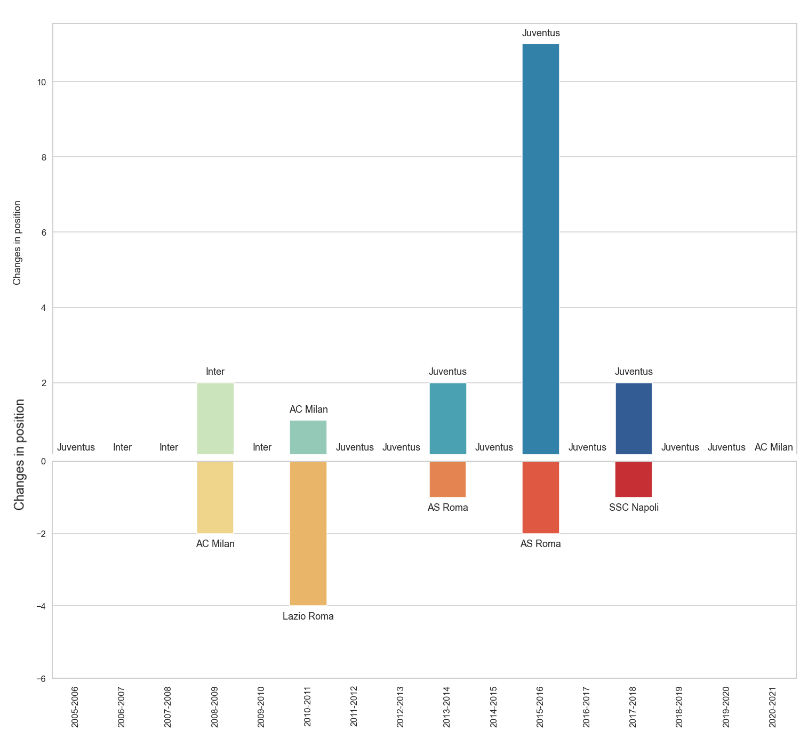

# serie_a_standings_analyis
Analysis of the last 15 years of Serie A's standings. Inspired by AC Milan's unbeaten run in the first 10 rounds of the 2020-21 season.
The data has been gathered from [WorldFootball](https://www.worldfootball.net/) using Python's BeautifulSoup library. The code for the scraping can be found under [webscraping.ipynb](https://github.com/ttothuk-proj/serie_a_standings_analyis/blob/main/webscraping.ipynb) and the resulting csv files are in [season_start.csv](https://github.com/ttothuk-proj/serie_a_standings_analyis/blob/main/season_start.csv) and [season_finish.csv](https://github.com/ttothuk-proj/serie_a_standings_analyis/blob/main/season_finish.csv).

